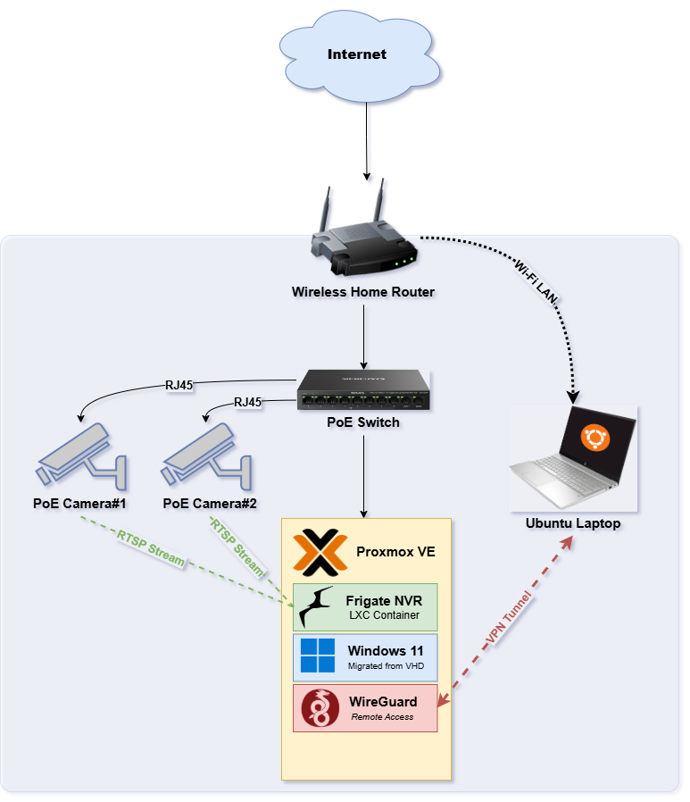

  

<h1 align="center">Homelab Infrastructure</h1>

  Self-hosted infrastructure built on repurposed enterprise hardware, covering virtualization, remote access, and network video surveillance.

  
  
  
  
  

---

## Overview

This repository documents a home infrastructure project built on a Dell Precision T1700 SFF repurposed as a Proxmox VE hypervisor. The objective is a self-managed environment covering virtualization, remote access, network segmentation, and video surveillance.

Each project below is scoped and implemented independently, with technical notes captured for reference.

---

## Hardware

| Component | Spec |
|---|---|
| **Host** | Dell Precision T1700 SFF |
| **CPU** | Intel Xeon E3-1371 v3 @ 3.60GHz (4C/8T) |
| **RAM** | 16GB DDR3 (4x 4GB, 1600 MT/s, Non-ECC UDIMM) |
| **Storage** | 1TB HDD |
| **GPU** | NVIDIA Quadro K620 (2GB VRAM) |
| **Hypervisor** | Proxmox VE |
| **Network** | Mercusys MS110CMP PoE Switch |
| **Cameras** | 2x TP-Link VIGI C440I (PoE) |
| **Client** | HP Laptop (Ubuntu) |

---

## Device Register

Devices follow the `NIX-[LOC]-[TYPE]-[SEQ]` naming convention.

| Device ID | Name | Model | OS | Status | Notes |
|---|---|---|---|---|---|
| NIX-HLB-SVR-01 | Homelab | Dell Precision T1700 SFF | Proxmox VE | Active | Xeon E3-1371 v3, 16GB DDR3, 1TB HDD, Quadro K620 |
| NIX-HLB-VPC-01 | Windows VM | VM | Windows 11 | Active | Hosted on NIX-HLB-SVR-01 |
| NIX-HLB-CAM-01 | Camera 1 | TP-Link VIGI C440I | N/A | In Progress | Connected via PoE switch |
| NIX-HLB-CAM-02 | Camera 2 | TP-Link VIGI C440I | N/A | In Progress | Connected via PoE switch |
| NIX-CLT-NB-02 | Client Laptop | HP | Ubuntu | Active | Primary administration device |

---

## Projects

### 1. Windows 11 VM Migration
**Status:** Completed

**Objective:** Migrate an existing Windows 11 installation (VHD) into a Proxmox-managed virtual machine.

**Implementation:**
- Transferred the source VHD to the Proxmox host
- Imported the disk directly to `local-lvm` storage via `qm importdisk`, avoiding the storage exhaustion associated with directory-based import
- Configured the VM with a VirtIO disk, CPU host passthrough, and memory ballooning disabled
- Pre-injected VirtIO drivers (`viostor.inf`, `vioscsi.inf`) via `pnputil` prior to first boot

**Technical notes:**
- VirtIO drivers must be injected before the disk bus type is switched. Switching without them results in an `INACCESSIBLE_BOOT_DEVICE` error on boot.
- Importing directly to `local-lvm` avoids the storage exhaustion that can occur when converting large disks through directory-based storage.

---

### 2. Remote Access (WireGuard VPN)
**Status:** Completed

**Objective:** Establish a WireGuard VPN tunnel between the Proxmox host and the primary client device for secure remote administration.

**Implementation:**
- WireGuard installed and configured on both the server and client
- Tunnel IPs assigned: server `10.0.0.1`, client `10.0.0.2`
- Key pairs generated and peer configurations exchanged
- IP forwarding enabled on the server
- WireGuard service enabled via `systemd`
- Router configured to forward UDP port 51820 to the WireGuard endpoint

---

### 3. Network Video Surveillance
**Status:** Planned

**Objective:** Integrate two PoE IP cameras with a self-hosted NVR running on Proxmox.

---

## Technology Stack

- **Hypervisor:** Proxmox VE
- **VPN:** WireGuard
- **Virtualization:** KVM/QEMU
- **Driver injection:** virtio-win
- **Hardware verification:** dmidecode
